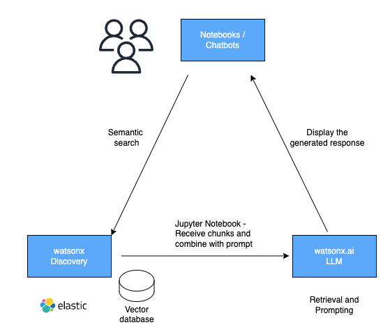

# Building On-Premises IBM Generative AI Empowered RAG Solutions to Enhance User Productivity

Watsonx is IBM's generative AI platform, officially launched on May 9, 2023 at the annual Think conference. The newly branded platform includes watsonx.ai, watsonx.data and watsonx.governance. You can find more details on watsonx at https://www.ibm.com/watsonx. 

As customers increasingly adopt cloud services available from IBM, Microsoft, Amazon, Google and others, customers may choose to stay on-prem for some workloads for security and other business reasons. Fortunately, IBM offers a complete on-prem infrastructure for generative AI services that not all service providers can do to meet unique business requirements. 

This document focuses on the on-prem watsonx.ai (current version 5.0.1) infrastructure deployment and AI powered retrieval-augmented generation solution development. It also covers the use of watsonx Orchestrate to build a user friendly chatbot without custom code required.

## The On-Prem watsonx.ai Deployment

The on-prem watsonx.ai Deployment including several key components.

- Red Hat OpenShift cluster in a server or virtualized environment
- IBM Cloud Pak for Data control plane (not the full suite)
- IBM watsonx.ai
- Nvidia GPU (hardware) and Operators for OpenShift
- IBM Watson Document Understanding (WDU)
- IBM watsonx Orchestrate
- IBM watsonx Discovery aka ElasticSearch
- IBM Fusion Storage aka General Parallel File System (GPFS)

### Meeting Prerequisites for watsonx.ai

For the customer engagement we worked with OpenShift 4.14. However, it is highly recommended that you work with OpenShift 4.15 or higher for supportability.

Before installing watsonx.ai, it is important that you meet all prerequisites, including both hardware and software. For more details check [System requirements](https://www.ibm.com/docs/en/cloud-paks/cp-data/5.0.x?topic=planning-system-requirements).

Also, install the latest version of OpenShift `oc` command tool and [Cloud Pak for Data cli](https://github.com/IBM/cpd-cli), `cpd-cli`.

### OpenShift AI

OpenShift AI is one dependency for watsonx.ai 5.0.0 and future releases. Follow the steps outlined in [Preparing OpenShift AI for use in IBM Cloud Pak for Data](https://docs.redhat.com/en/documentation/red_hat_openshift_ai_self-managed/2.8/html/installing_and_uninstalling_openshift_ai_self-managed/preparing-openshift-ai-for-ibm-cpd_prepare-openshift-ai-ibm-cpd.html#preparing-openshift-ai-for-ibm-cpd_prepare-openshift-ai-ibm-cpd)

Do not use the [Installing and deploying OpenShift AI](https://docs.redhat.com/en/documentation/red_hat_openshift_ai_self-managed/2.8/html/installing_and_uninstalling_openshift_ai_self-managed/installing-and-deploying-openshift-ai_install#installing-and-deploying-openshift-ai_install) document. Instead, use the document for CP4D.

### Nvidia Operators

Watsonx.ai requires GPUs. When Nvidia GPUs are used, install two required operators for OpenShift per documentation. More details on [Installing operators for services that require GPUs](https://www.ibm.com/docs/en/cloud-paks/cp-data/5.0.x?topic=software-installing-operators-services-that-require-gpus). If other branded GPUs are used, follow instructions from IBM/Red Hat or the hardware provider.

- Complete Installing the [Node Feature Discovery (NFD) Operator](https://docs.nvidia.com/datacenter/cloud-native/openshift/23.9.2/install-nfd.html) in the NVIDIA GPU Operator on Red Hat OpenShift Container Platform documentation.
- Complete Installing the [NVIDIA GPU Operator](https://docs.nvidia.com/datacenter/cloud-native/openshift/23.9.2/install-gpu-ocp.html) in the NVIDIA GPU Operator on Red Hat OpenShift Container Platform documentation.

### Deploying Cloud Pak for Data control Plane

The Cloud Pak for Data (CP4D) control plane is required before you can install watsonx.ai. 

Check details on [Installing the IBM Cloud Pak for Data control plane](https://www.ibm.com/docs/en/cloud-paks/cp-data/5.0.x?topic=data-installing-cloud-pak).

Note that you can install some of CP4D components or services in the same namespace or different ones. For the latter, you will need to take an extra step, [Tethering projects to the IBM Cloud Pak for Data control plane](https://www.ibm.com/docs/en/cloud-paks/cp-data/5.0.x?topic=data-tethering-projects-control-plane).

For more details on CP4D components, check [Determining which IBM Cloud Pak for Data components to install](https://www.ibm.com/docs/en/cloud-paks/cp-data/5.0.x?topic=information-determining-which-components-install).

### Installing watsonx.ai

Ensure that you have installed all prerequisites, for example, OpenShift AI and Nvidia operators. Also, ensure that all of the components that are associated with an instance of Cloud Pak for Data are installed at the same release, e.g. version 5.0.1.

For detailed instructions, check [Installing IBM watsonx.ai](https://www.ibm.com/docs/en/cloud-paks/cp-data/5.0.x?topic=watsonxai-installing).

### Adding watsonx.ai foundation models

You are now ready to add one or more foundation models or large language models (LLM). See installation details at [Adding foundation models to IBM watsonx.ai](https://www.ibm.com/docs/en/cloud-paks/cp-data/5.0.x?topic=setup-adding-foundation-models).

### Adding custom models

Out of the box, IBM watsonx.ai provides support for two dozens or so foundation models, include the Granite series, Meta's Llama3 models, Google's flan models, and Mixtral models. You can find the complete list of [supported models](https://www.ibm.com/docs/en/cloud-paks/cp-data/5.0.x?topic=solutions-supported-foundation-models) here. 

However, you can add custom models that are available at HuggingFace or else where. For more details, check [Planning to deploy a custom foundation model](https://www.ibm.com/docs/en/cloud-paks/cp-data/5.0.x?topic=model-planning-deploy-custom-foundation)

Once watsonx.ai and LLMs are deployed, you can build python notebooks to work with the large language models that are deployed in the environment.

## Deploying Watson Understanding Document

Watson Understanding Document (WDU) is IBM document conversion technology that will be available at part of watsonx.ai. It can process pdf and image documents and will support other formats such as Word and PowerPoint.

WDU is available through an internal distribution but will be broadly available through watsonx.ai.

To deploy WDU to an OpenShift cluster, check the [deployment instructions](docs/how%20to%20deploy%20wdu%20to%20openshift.md).

## Installing watsonx Orchestrate

IBM watsonx Orchestrate (WxO) is a generative AI and automation solution. With the assistant builder, you can interact with AI models and find information based on the business specific contents, and take a series of actions to accomplish simple and complex tasks through a user friendly chatbot. 

Before installing WxO, you must complete the prerequisites, including App Connect, Multicloud Object Gateway and Red Hat OpenShift Serverless Knative Eventing. 

If you want to improve response times in WxO, you can increase the CPU and memory specs in OpenShift.

```
spec:
  watsonAssistants:
    config:
      configOverrides:
        store:
          extra_vars:
            store:
              NODEJS_HEAP_SIZE: 1792
          resources:
            store:
              limits:
                memory: 2Gi
              requests:
                memory: 2Gi
```

### IBM App Connect

Follow the instructions on [Installing IBM App Connect in containers](https://www.ibm.com/docs/en/cloud-paks/cp-data/5.0.x?topic=software-installing-app-connect).

### Multicloud Object Gateway 

https://www.ibm.com/docs/en/cloud-paks/cp-data/5.0.x?topic=orchestrate-installing

Multicloud Object Gateway is installed and configured.	If this task is not complete, see Installing Multicloud Object Gateway.
The secrets that enable watsonx Orchestrate to connect to Multicloud Object Gateway exist.	If this task is not complete, see Creating secrets for services that use Multicloud Object Gateway.

Follow the instructions on [Deploy standalone Multicloud Object Gateway](https://docs.redhat.com/en/documentation/red_hat_openshift_data_foundation/4.14/html/deploying_openshift_data_foundation_using_bare_metal_infrastructure/deploy-standalone-multicloud-object-gateway#deploy-standalone-multicloud-object-gateway).

Then, complete the steps for [Creating secrets for services that use Multicloud Object Gateway](https://www.ibm.com/docs/en/cloud-paks/cp-data/5.0.x?topic=piicpd-creating-secrets-services-that-use-multicloud-object-gateway)

### Knative Eventing

Follow the instructions on [Installing Red Hat OpenShift Serverless Knative Eventing](https://www.ibm.com/docs/en/cloud-paks/cp-data/5.0.x?topic=software-installing-red-hat-openshift-serverless-knative-eventing).

Note: The cpd-cli command lines use the following namespaces, which may be different from the CP4D operator namespace and CP4D instance namespace you have defined and used for CP4D control plane and watsonx.ai.

```
cpd_operator_ns=ibm-knative-events 
cpd_instance_ns=knative-eventing
```

### Install Orchestrate

Follow the instructions on [Installing watsonx Orchestrate](https://www.ibm.com/docs/en/cloud-paks/cp-data/5.0.x?topic=orchestrate-installing)

## Installing watsonx Discovery

watsonx Discovery is powered by the Elasticsearch platform and made available through IBM watsonx offerings.

watsonx Discovery integrates well with watsonx Orchestrate (WxO) and watsonx Assistant (WxA).

Deploy watsonx Discovery on-prem (or in the cloud), check [Elasticsearch Installation and Setup Documentation](https://github.com/watson-developer-cloud/assistant-toolkit/tree/master/integrations/extensions/docs/elasticsearch-install-and-setup).

For semantic search, you can use the built-in [Elastic Learned Sparse EncodeR (ELSER)](https://www.elastic.co/guide/en/machine-learning/current/ml-nlp-elser.html) service. However, you can also use third-party services, such as the sentence transformer model, `all-minilm-l6-v2`.

## Build RAG Solutions

We are now ready to use the watsonx.ai platform to build retrieval-augmented generation (RAG) solutions in python notebooks or virtual assistants or chatbots. 

### Build Python Notebooks

This typically involves the following steps.

- processing the documents, in our case, using WDU.
- creating indexes for keyword and semantic search, in our case, using ElasticSearch.
- creating a prompt template. It is often provided by the model providers but you can create your own.
- submitting the query to a LLM, in our case, IBM foundation model or a custom model from Hugging Face.
- displaying responses 
- tweaking the notebook if necessary 

The hig-level diagram illustrates the RAG solution.



The sample [notebook](docs/rag_notebook.ipynb) is included here. Note that it was tested using IBM watsonx.ai and ElasticSearch cloud services. Some authentication code changes may be necessary when using on-prem watsonx.ai deployment.

Also, since we used a sentence transformer model, `all-minilm-l6-v2` instead of the built-in ELSER model in the sample notebook, it is required that you deploy the custom model to the ElasticSearch. Check details on [Import the trained model and vocabulary](https://www.elastic.co/guide/en/machine-learning/8.11/ml-nlp-import-model.html)

### Using Virtual Assistant in WxO

Virtual assistants or chatbots are preferred user interface to end users. With the embedded AI assistant builder in WxO, you can easily create a chatbot that allows users to search and find the right information using the built-in "Conversational Search" option. 

WxO Assistant architecture


Below are a few simple steps:

- configure the search integration by providing the url for the search service and user access credentials.
- add index (or indexes separated by comma) that you created with the notebook.
- configure the query body in advanced ElasticSearch settings using the json text as shown below.


```
{
    "knn": {
        "field": "embedding",
        "query_vector_builder": {
            "text_embedding": {
                "model_id": "sentence-transformers__all-minilm-l6-v2",
                "model_text": "$QUERY"
            }
        },
        "k": 10,
        "num_candidates": 100
    },
    "_source": [
        "id",
        "text"
    ]
}
```
- optionally, customize the background with an image or website url
- preview the chatbot, ask questions and get answers back


## Acknowledgement

I'd like to acknowledge many IBMers who contributed to the work upon which the document is based.

- IBM watsonx sales team - Travis Jeanneret, Will Hawkins, Gary Walker, MIKE MCMAHON
- IBM Client Engineering team - DARREN D'Amato, Tabitha Brett, Vahi Guner, Jeniya Tabassum, Alex Cravalho, Ryan Menossi
- IBM Expert Labs -  Darshan Vala, Jun Ahn  
- IBM Watsonx product teams -  Albert Grankin, Angad Singh, Casey Honaker, Zach Shu, MANU THAPAR,  Mike Whitley